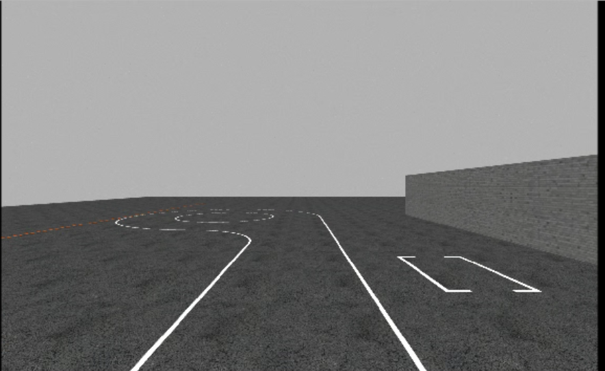

# Simulator PilotNet Workflow

Simulator repository:

```text
https://github.com/harishkumarbalaji/POLARIS_GEM_Simulator
```

Scene preview:



This folder contains the host-side simulator training workflow for the GEM
PilotNet lane-following model. The shared model definition remains at:

```text
../pilotnet_model.py
```

The ROS-side simulator nodes live in the POLARIS GEM simulator workspace:

```text
/home/$USER/gem_simulation_ws/src/POLARIS_GEM_Simulator/gem_simulator/gem_gazebo/scripts/
```

Relevant ROS nodes:

- `record_teacher_path.py`
- `teacher_path_follow.py`
- `collect_pilotnet_data.py`
- `pilotnet_inference.py`

## Current Best Model

Repository-relative path:

```text
pilotnet_runs/run_teacher_student_13sessions_stronger_001/best_model.pt
```

Container path pattern:

```text
<repo-container-path>/pilotnet_runs/run_teacher_student_13sessions_stronger_001/best_model.pt
```

`<repo-container-path>` is the path to this repository from inside the simulator
container. If the repository is under your host home directory, the simulator
container usually sees it under `/home/$USER/host/...`.

Validated inference command:

```bash
export REPO_CONTAINER_PATH=/home/$USER/host/<path-to-IL_PilotNet>

rosrun gem_gazebo pilotnet_inference.py \
  _checkpoint:=$REPO_CONTAINER_PATH/pilotnet_runs/run_teacher_student_13sessions_stronger_001/best_model.pt \
  _speed:=1.00 \
  _max_steering:=1.00 \
  _steering_scale:=1.0 \
  _steering_smoothing:=0.50
```

This was the best observed simulator combination.

## Path Rule

Inside the simulator Docker container, the host home directory is mounted at:

```text
/home/$USER/host
```

Examples:

```text
Host:      /home/$USER/teacher_paths/teacher_path.csv
Container: /home/$USER/host/teacher_paths/teacher_path.csv

Host:      /home/$USER/pilotnet_data_teacher
Container: /home/$USER/host/pilotnet_data_teacher
```

Save persistent simulator outputs under `/home/$USER/host/...` from inside the
container.

## 1. Start Simulator

From the host:

```bash
cd ~/gem_simulation_ws/src/POLARIS_GEM_Simulator
bash run_docker_container.sh
```

Inside the container:

```bash
cd ~/host/gem_simulation_ws
catkin_make
source devel/setup.bash
roslaunch gem_launch gem_init.launch world_name:="highbay_track.world" x:=12.5 y:=-21 yaw:=3.1416 custom_scene:=false
```

`custom_scene:=false` was the stable setting on this machine.

Reset vehicle pose when needed:

```bash
cd ~/host/gem_simulation_ws/src/POLARIS_GEM_Simulator
python3 utils/set_pos.py --x 12.5 --y -21 --yaw 3.1416
```

## 2. Record A Manual Teacher Path

Terminal A, inside the container:

```bash
source devel/setup.bash
rosrun gem_gazebo record_teacher_path.py \
  _output_csv:=/home/$USER/host/teacher_paths/teacher_path.csv
```

Terminal B, inside the container:

```bash
source devel/setup.bash
cd ~/host/gem_simulation_ws/src/POLARIS_GEM_Simulator
python3 -m pip install --user pynput
python3 utils/generate_waypoints.py _max_speed:=0.5
```

Drive with `w a s d`. Stop the recorder after a clean lap.

## 3. Generate Teacher Paths From Manual Sessions

If a manual data session is good, convert its pose stream into a teacher path:

```bash
cd <IL_PilotNet>

.venv/bin/python for_simulator/scripts/metadata_to_teacher_paths.py \
  --data-root /home/$USER/pilotnet_data_manual \
  --output-dir /home/$USER/teacher_paths/from_manual_sessions
```

## 4. Run Teacher Follow

Inside the container:

```bash
source devel/setup.bash
rosrun gem_gazebo teacher_path_follow.py \
  _path_csv:=/home/$USER/host/teacher_paths/from_manual_sessions/session_20260502_001930_teacher_path.csv \
  _speed:=0.45 \
  _lookahead:=2.0 \
  _max_steering:=0.55
```

For teacher-student data collection, run several laps from useful start
positions and track segments. The best current model used 13 teacher-student
sessions.

## 5. Collect PilotNet Data

Inside the container, while the teacher is driving:

```bash
source devel/setup.bash
rosrun gem_gazebo collect_pilotnet_data.py \
  _output_root:=/home/$USER/host/pilotnet_data_teacher
```

This writes host-side session folders under:

```text
/home/$USER/pilotnet_data_teacher
```

Each session contains:

```text
session_*/
  images/
  metadata.csv
```

The simulator label is `/ackermann_cmd.steering_angle`. No real-car steering
ratio conversion is used for simulator-trained models.

## 6. Train On Host

From the project root:

```bash
cd <IL_PilotNet>
source .venv/bin/activate
```

Recommended optimized command for new simulator training:

```bash
python for_simulator/train_pilotnet.py \
  --data-root /home/$USER/pilotnet_data_teacher \
  --output-dir pilotnet_runs/run_teacher_student_next \
  --epochs 40 \
  --batch-size 128 \
  --learning-rate 3e-4 \
  --weight-decay 1e-4 \
  --val-fraction 0.2 \
  --split-mode per-session-frame \
  --crop-top-ratio 0.35 \
  --num-workers 4 \
  --image-cache-policy auto \
  --image-cache-max-gb 24 \
  --image-cache-ram-fraction 0.75 \
  --preload-workers 8 \
  --loss smooth_l1 \
  --min-abs-speed 0.05 \
  --amp auto \
  --channels-last \
  --torch-compile \
  --compile-mode reduce-overhead
```

The current best checkpoint was trained with the same dataset and main
hyperparameters, before the optimization flags were added to the script. Its
stored `train_args.json` is the source of truth for that checkpoint.

### Training Optimizations

`train_pilotnet.py` includes a few speed-oriented options for small and
medium-sized simulator datasets:

- `--image-cache-policy auto` estimates the processed image cache size and
  preloads images into CPU RAM when they fit the configured memory budget. This
  avoids repeatedly decoding and resizing JPEGs every epoch.
- `--preload-workers 8` parallelizes the one-time image preload step with
  Python threads. This helps because image decode/resize work is mostly done in
  PIL/native code.
- `--amp auto` uses CUDA mixed precision when available.
- `--channels-last` uses a convolution-friendly CUDA memory layout.
- `--torch-compile --compile-mode reduce-overhead` asks PyTorch to compile the
  model. It adds startup cost, but can help longer runs after compilation
  finishes.

When RAM caching is enabled, the script sets DataLoader `num_workers` to `0` to
avoid duplicating the cached images across worker processes.

## 7. Train/Valid Split

Use:

```text
--split-mode per-session-frame
```

Each session is split by time: the first `(1 - val_fraction)` portion goes to
training and the last `val_fraction` portion goes to validation.

This avoids making one full session validation when sessions have different
roles, for example one full loop versus several curve/recovery sessions. The
metric is still optimistic because nearby frames from the same session are
visually similar, but it was more useful than a session-level split for this
small simulator dataset.

## 8. Run Inference

Inside the simulator container after `source devel/setup.bash`:

```bash
export REPO_CONTAINER_PATH=/home/$USER/host/<path-to-IL_PilotNet>

rosrun gem_gazebo pilotnet_inference.py \
  _checkpoint:=$REPO_CONTAINER_PATH/pilotnet_runs/run_teacher_student_13sessions_stronger_001/best_model.pt \
  _speed:=1.00 \
  _max_steering:=1.00 \
  _steering_scale:=1.0 \
  _steering_smoothing:=0.50
```

Optional debug image dump:

```bash
export REPO_CONTAINER_PATH=/home/$USER/host/<path-to-IL_PilotNet>

rosrun gem_gazebo pilotnet_inference.py \
  _checkpoint:=$REPO_CONTAINER_PATH/pilotnet_runs/run_teacher_student_13sessions_stronger_001/best_model.pt \
  _speed:=1.00 \
  _max_steering:=1.00 \
  _steering_scale:=1.0 \
  _steering_smoothing:=0.50 \
  _debug_save_images:=true \
  _debug_output_dir:=$REPO_CONTAINER_PATH/for_simulator/sim_debug \
  _debug_save_interval:=1.0
```

`sim_debug/` is ignored by git.

## Real-Data-To-Simulator Experiments

We tried multiple real-data-to-simulator experiments, including crop alignment,
grayscale/autocontrast preprocessing, steering sign flips, and estimated
PACMod-to-Ackermann steering ratios. These models did not drive well in the
simulator. The likely causes were domain shift and inconsistent visual cues:
real highbay images included building/background context, camera placement and
contrast differed from simulation, and steering labels did not map cleanly to
the simulator front-wheel command.

The simulator path above is now the recommended approach: collect simulator
teacher-student data and train directly on simulator `/ackermann_cmd` labels.
